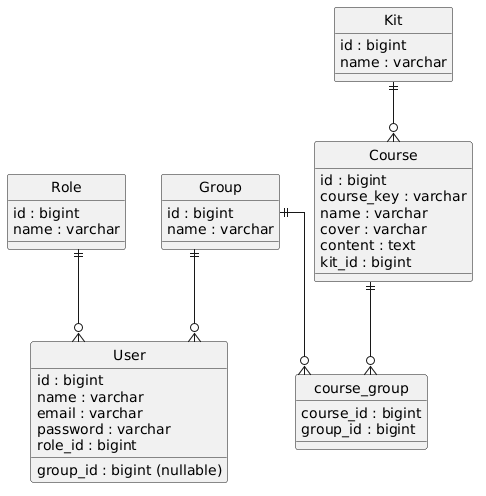

# Robotics School Platform

## Project description
This is a comprehensive platform developed for a small robotics school. It allows administrators to manage users and courses, teachers to facilitate their classes, and students to access and consult their assigned educational materials. The system dynamically links courses to specific robotics kits and organizes students into distinct learning groups.

## ER Diagram
